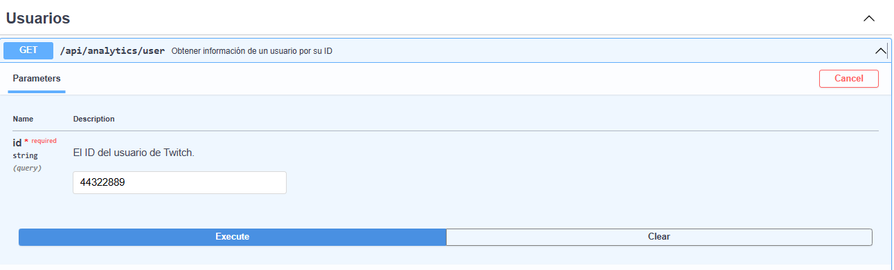
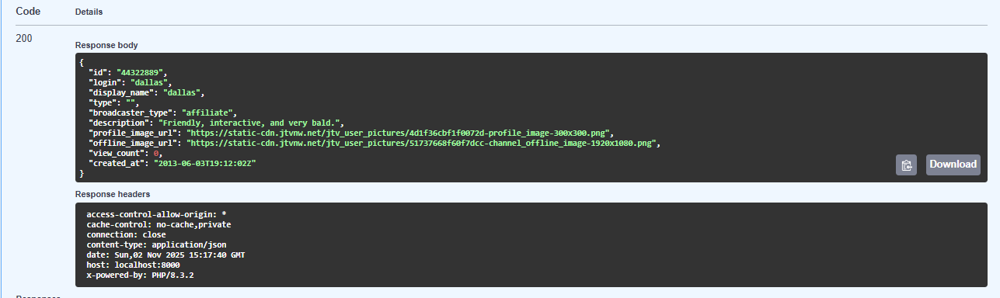
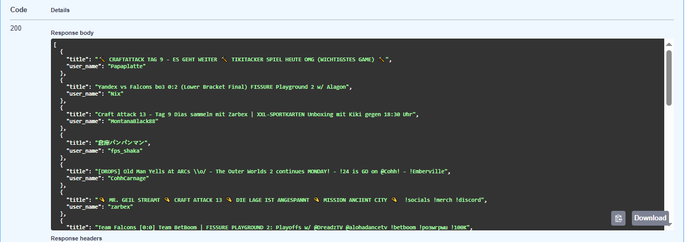

# Twitch Analytics API

API REST para consultar información de usuarios y streams en vivo de Twitch.

## Requisitos

-   PHP 8.3.2
-   Composer 2.6.6
-   Laravel 5.4.0

## Instalación

```bash
# Clonar repositorio
git clone git@github.com:mariaines02/twitch-analytics.git
cd twitch-analytics

# Instalar dependencias
composer install

# Configurar entorno
copy .env.example .env
php artisan key:generate

# Crear la base de datos
php artisan migrate

# Iniciar servidor
php artisan serve
```

## Configuración

Edita `.env` con tus credenciales de Twitch:

```env
TWITCH_CLIENT_ID=######
TWITCH_CLIENT_SECRET=#####
TWITCH_TOKEN_URL=https://id.twitch.tv/oauth2/token
TWITCH_API_URL=https://api.twitch.tv/helix
```

## Endpoints

### Obtener información de usuario

```bash
GET /api/analytics/user?id={user_id}
```

**Ejemplo:**

```bash
curl "http://localhost:8000/api/analytics/user?id=44322889"
```

**Respuesta:**

```json
{
    "id": "44322889",
    "login": "dallas",
    "display_name": "dallas",
    "type": "staff",
    "broadcaster_type": "",
    "description": "Just a gamer playing games and chatting...",
    "profile_image_url": "https://static-cdn.jtvnw.net/jtv_user_pictures/...",
    "offline_image_url": "https://static-cdn.jtvnw.net/jtv_user_pictures/...",
    "view_count": 191836881,
    "created_at": "2013-06-03T19:12:02Z"
}
```

400 Bad Request – Falta o es inválido el parámetro id

404 Not Found – Usuario no encontrado

401 Unauthorized – Token de Twitch inválido o expirado

500 Internal Server Error – Error interno del servidor

### Streams en vivo

GET /api/analytics/streams

**Ejemplo:**

```bash
curl "http://localhost:8000/api/analytics/streams"
```

**Respuesta:**

```json
[
    {
        "title": "⛏️ CRAFTATTACK TAG 8 - ES GEHT WEITER ⛏️",
        "user_name": "Papaplatte"
    },
    {
        "title": "[DROPS ON] BIG DAY HUGE DRAMA NEW BIG NEWS AND GAMES",
        "user_name": "zackrawrr"
    }
]
```

Errores posibles: 401 Unauthorized, 500 Internal Server Error

## Documentación API

Documentación interactiva disponible en: `http://localhost:8000/api/docs.html`
$<p align="center">  </p> <p align="center">  </p> <p align="center">  </p>

## Tests

```bash
php artisan test tests/Feature/AnalyticsControllerTest.php
php artisan test tests/Unit/TwitchServiceTest.php
```

## Tests de endpoints

```bash
curl "http://localhost:8000/api/analytics/user?id=44322889"
curl -i "http://localhost:8000/api/analytics/user?id="
curl -i "http://localhost:8000/api/analytics/user?id=111111"

```

## Arquitectura

```
app/
├── Exceptions/
│   └── TwitchApiException.php # Manejo centralizado de errores de Twitch
├── Http/
│   └── Controllers/
│       └── AnalyticsController.php # Endpoints de la API
└── Services/
    └── TwitchService.php # Lógica de comunicación con Twitch

config/
└── services.php # Configuración de servicios externos

routes/
└── api.php # Definición de rutas

tests/
├── Feature/
│   └── AnalyticsControllerTest.php # Tests de endpoints
└── Unit/
    └── TwitchServiceTest.php # Tests del servicio

```

## Características

-   Gestión automática de tokens OAuth
-   Sin base de datos (datos en tiempo real)
-   Manejo de errores personalizado
-   Suite completa de tests
-   Documentación OpenAPI

# Decisiones técnicas principales

1. Lenguaje y framework:
   Laravel se eligió por familiaridad y facilidad de manejo, aunque podría implementarse con Node.js u otras tecnologías.

2. Servicio dedicado (TwitchService):
   Toda la lógica de interacción con Twitch está centralizada aquí para facilitar mantenimiento y testing.

3. Gestión de tokens OAuth:

-   Generación automática al primer uso

-   Almacenamiento en caché con tiempo de expiración

-   Regeneración automática si la API devuelve 401

4. Base de datos:
   Todos los datos se obtienen en tiempo real de la API de Twitch. Se usa SQLite solo para simplificar la configuración de Laravel.

5. Validación de entrada:
   Se valida el parámetro id usando Laravel Validator, con mensajes claros en caso de error.

6. Testing:

-   Tests unitarios para TwitchService

-   Tests de feature para AnalyticsController

-   Uso de mocks para simular la API de Twitch

7. Documentación:
   Documentación interactiva generada con OpenAPI.

# Hipótesis y decisiones sobre el enunciado

-   Ruta de endpoints: /api/analytics/user para mejor organización según Laravel.

-   Formato de respuestas: JSON.

-   Regeneración de tokens: Automática.

-   Número de streams por defecto: 20 (ajustable en el servicio).

## Contacto

**María Inés Haddad**  
📧 mariahaddad@hotmail.fr  
🔗 [GitHub](https://github.com/mariaines02)
